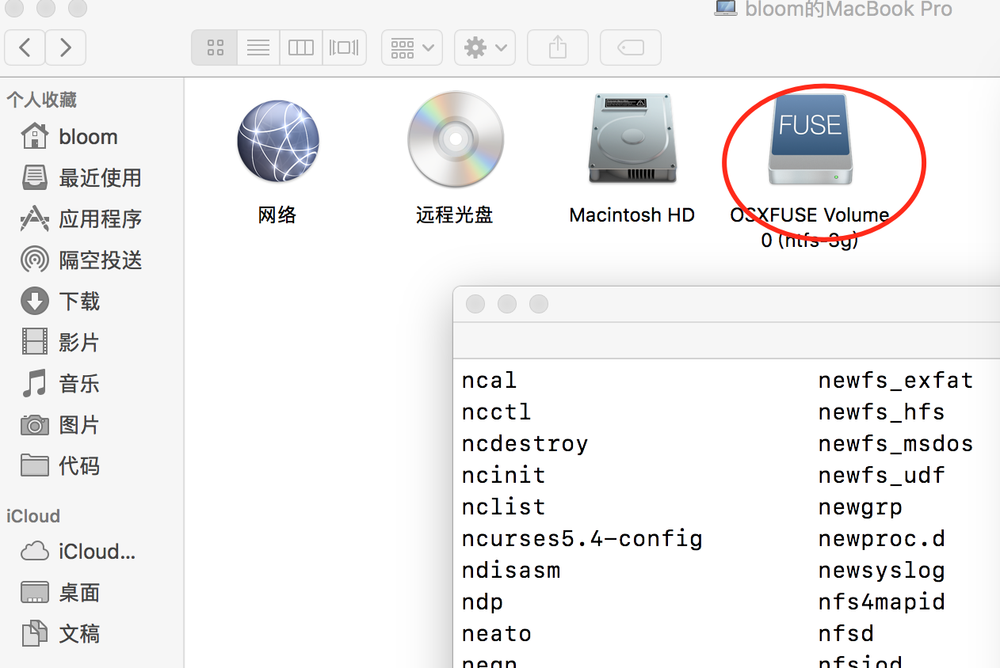

# Markdown 笔记


[TOC]

## Markdown 中插入公式

如果不支持`latex`公式，则导入`MathJax`: 

```javascript
<script type="text/javascript" src="http://cdn.mathjax.org/mathjax/latest/MathJax.js?config=default"></script>
```
一段示例：

```latex
$$x=\frac{-b \pm \sqrt {b^2 - 4ac}}{2a}$$
```
效果如下：
$$
x_{1,2}=\frac{-b \pm \sqrt {b^2 - 4ac}}{2a}
$$

## Markdown 高亮文本

高亮语法如下:

```markdown
==hello==
```

效果如下:

==hello==


## 上标

需要作为上标的部分需要被\^包围:

```markdown
a^2^ + 2a + 1
```

效果如下:

a^2^ + 2a + 1


## 下标

```markdown
H~2~O
```

H~2~O

## 行内公式

```latex
$x=\frac{-b \pm \sqrt {b^2 - 4ac}}{2a}$
```

效果如下:

$x=\frac{-b \pm \sqrt {b^2 - 4ac}}{2a}$

行内公式、上下标、高亮等需要在==偏好设置==里配置.


## 脚注

> 脚注像是参考文献, 特别是把脚注的id定义成数字的时候.脚注的定义一般放在最后, 其实位置是无所谓的,定义的地方是不会在最终渲染的文档中显示的.

语法格式:

```markdown
<!--定义语法-->
[^id]: link_href "Link Title"

<!--引用语法-->
[^id]
```

效果如下:

你好世界,百度[^1]是个不过的中文引擎,强烈推荐你使用.

[^1]: https://www.baidu.com "百度一下,你就知道"

## 参考链接

> 参考链接的定义和脚注很像, 和脚注相比,有几点区别:
>
> - 定义和引用的时候,不需要使用^
> - 引用的时候需要两对方括号
>
> 但是参考链接是链接, 而脚注更像是标记书籍等的参考文献.
>
> 同脚注, 参考链接的定义的位置也是无关的.使用参考比直接使用链接定义的可读性更高,建议使用链接的地方都用参考链接

定义语法如下:

```markdown
[id]: Link_href "Link Title"
```

引用语法如下:

```markdown
[Link_Text][id]
```

效果如下:

[百度一下, 你就知道][baidu]

[baidu]: https://www.baidu.com "baidu"

## 流程图

markdown的流程图比较死板,缺乏灵活度,条件判断时只能选择yes或no.

基本语法如下,

```markdown
​```flow
A=>start: node content
B=>operation: operation content
C=>condition: compare
D=>operation: yes operation
E=>operation: no operation

A->B->C(yes)->D
C(no)->E
​```

```

效果如下:

```flow
A=>start: node content
B=>operation: operation content
C=>condition: compare
D=>operation: yes operation
E=>operation: no operation

A->B->C(yes)->D
C(no)->E

```

## 时序图

```markdown
​```sequence
NodeA->NodeB: edge title
Note right of NodeB: 备注
NodeB-->NodeA: edge title
​```
```

效果图如下:

```sequence
NodeA->NodeB: edge title
Note right of NodeB: 备注
NodeB-->NodeA: edge title
```

箭头种类:

- 实三角箭头: ->, —>
- 虚箭头: ->>, —>>
- 双向箭头: 暂无

```sequence
A->B: ->
B->>C: ->>
C-->>B: -->>
B-->A: -->
```

## 列表

### 无序列表

```markdown
- item one
- item two

* item one
* item two

+ item one
+ item two

- item 1
	- item 1.1
	- item 1.2
	- item 1.3
		- item 1.3.1
		- item 1.3.2
		- item 1.3.3
- item 2
- item 3
```

效果:

- item one
- item two

* item one
* item two

+ item one
+ item two

- item 1
  - item 1.1
  - item 1.2
  - item 1.3
    - item 1.3.1
    - item 1.3.2
    - item 1.3.3
- item 2
- item 3

### 有序列表

> 数字顺序无所谓.

```markdown
1. item one
2. item two
2. item three

1. item one
	1.1 item one
	1.2 item two
2. item two

```

效果如下:

1. item one
2. item two
3. item three
4. item one
  1.1 item one
  1.2 item two
5. item two

## 图片

```markdown

```




## 表格

```markdown
|head one | header two | head three | head four  |
|---------|:-----------|-----------:|:----------:|
| col 1   | col 2      | col 3      | col 4      |
```

| head one | header two | head three | head four |
| -------- | :--------- | ---------: | :-------: |
| col 1    | col 2      |      col 3 |   col 4   |

### 表格的对齐

- 左对齐 `:——`或 `---`
- 右对齐 `---:`
- 居中`:---:`

## 分隔线

> 三个以上的星号、减号或下划线

```markdown
---

***

___
```

---

***

___

## 强调

### 斜体

```markdown
*haha*
_haha_
```

*haha*

_haha_

### 粗体

```markdown
**haha**
__haha__
```

**haha**

__haha__

### 删除线

```markdown
~~hello world~~
```

~~hello world~~

### 下划线

直接使用html标签<u> 或直接公式:

```latex
$\underline{Hello world}$
```

$\underline{Hello, world}$

<u>Hello, world</u>

### 上划线

数学公式:

```latex
$\overline{Hello, world}$
```

$\overline{Hello, world}$


## 复选框

> 复选框需要和列表配合使用.

```markdown
- [x] hello
- [ ] world
```

- [x] hello
- [ ] world


## 转义字符

```
\   反斜线
`   反引号
*   星号
_   底线
{}  花括号
[]  方括号
()  括弧
#   井字号
+   加号
-   减号
.   英文句点
!   惊叹号
```


## 公式语法

### 矩阵

```markdown
$$
\left(
\begin{array}{lcr}
a & b & c \\
d & e & f
\end{array}
\right)
$$
```

$$
\left(
\begin{array}{lcr}
a  &  b  & c \\
d  &  e  &  f
\end{array}
\right)
$$

### 常规用法s

| 特殊字符         | 说 明                   | 实例                              | 完整字符串                             |
| ------------ | --------------------- | ------------------------------- | --------------------------------- |
| $            | 数学公式前后加$是行内公式         | 数学公式:$a=x+y$                    | 数学公式:`$a=x+y$`                    |
| $$           | 数学公式加$$就是读占一行的公式      | 独占一行:$$a=x+y$$                  | 独占一行:`$$a=x+y$$`                  |
| \            | 转义字符,特殊字符要显示原意,就在前面加\ | $\$$                            | `$\$$`                            |
| \\\          | 在数学公式中是换行             | $a=x+y\\b=y$                    | `$a=x+y\\b=y$`                    |
| _            | 后跟内容为下标               | $a_i$                           | `$a_i$`                           |
| ^            | 后跟内容为上标               | $a^i$                           | `$a^i$`                           |
| {}           | 被括号起来的公式是一组内容         | $x_{22}y^{(x)}x^{y^z}$          | `$x_{22}y^{(x)}x^{y^z}$`          |
| \frac        | 分数                    | $\frac{1}{a}$                   | `$\frac{1}{a}$`                   |
| \sqrt        | 开根                    | $\sqrt{xy}+\sqrt[a]{x}$         | `$\sqrt{xy}+\sqrt[a]{x}$`         |
| \ldots       | 跟文本底线对齐的省略号           | $a_{i\ldots{n}}$                | `$a_{i\ldots{n}}$`                |
| \cdots       | 跟文本中线对齐的省略号           | $i\cdots n$                     | `$i\cdots n$`                     |
| \left \right | 用于自适应匹配分隔符如{,(,\|等    | $\frac{du}{dx} |_{x=0}$         | `$\frac{du}{dx} |_{x=0}$`         |
| \sum         | 求和                    | $\sum_{k=1}^nkx $               | `$\sum_{k=1}^nkx $`               |
| \int         | 积分                    | $\int_a^b$                      | `$\int_a^b$`                      |
| \limits      | 强制上下限在上下侧             | $\sum\limits_{k=1}^nkx $        | `$\sum\limits_{k=1}^nkx $`        |
| \nolimits    | 强制上下限在右侧              | $\sum\nolimits_{k=1}^nkx$       | `$\sum\nolimits_{k=1}^nkx$`       |
| \overline    | 上划线                   | $\overline{a+b}$                | `$\overline{a+b}$`                |
| \underline   | 下划线                   | $\underline{a+b}$               | `$\underline{a+b}$`               |
| \overbrace   | 上花括号                  | $\overbrace{a+b+\dots+n}^{m个}$  | `$\overbrace{a+b+\dots+n}^{m个}$`  |
| \underbrace  | 下花括号                  | $\underbrace{a+b+\dots+n}_{m个}$ | `$\underbrace{a+b+\dots+n}_{m个}$` |
| \vec         | 向量                    | $\vec{a}$                       | `$\vec{a}$`                       |


