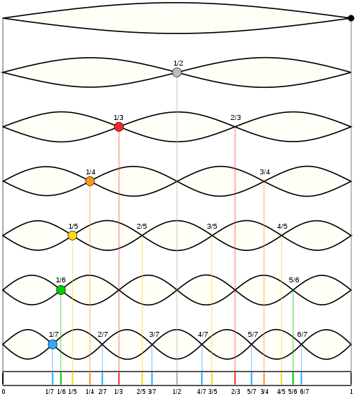
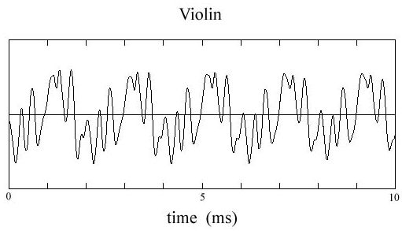
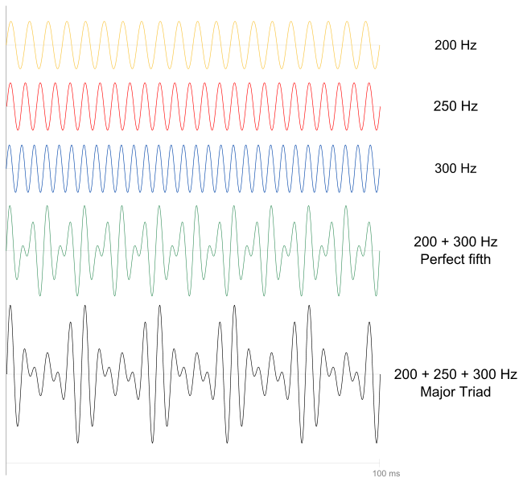
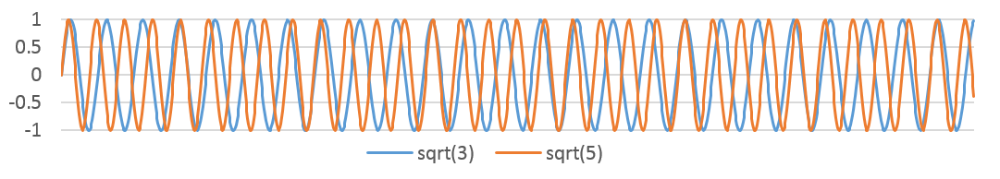
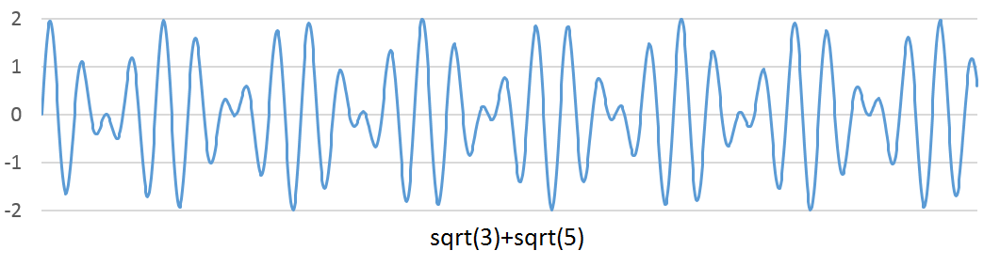

# 声学基础

[TOC]

技术类工作十余年，思维方式愈发趋于纯理性动物：万物有定义、有果必求因、凡事靠推理，诚然这样的方法论太过缺乏人文情怀。不光自己，身边的大批科学家、工程师也深受纯粹理性的毒害。加之在匪帮的体制下从小到大都没有接受过正式的音乐教育，导致绝大多同学根本不懂音乐，也不会欣赏音乐，实乃人生一大憾事。

我们要完成自我救赎，基本的方法就是学习一些基本的人文知识。在音乐方面我们最好能学习一门乐器，有一定经济基础的同学最好能买一架钢琴，这不仅可以使我们苦逼的人生变得更多滋有趣，还可以活动你僵硬的肩膀、颈椎和手腕。吉他也是很好的乐器，便于携带，容易上手，没事还可以弹唱一曲来吸引妹子。就算实在没有音乐细胞，在街上听到古典音乐时和妹子谈一谈它的调式与调性，那逼格直接爆表不是？此外，立志从事计算机辅助作曲、编曲和调音行业的码农也未必真的懂得音乐，而基本的音乐知识却成为了巨大的绊脚石。

音乐不可不学！

请欣赏：李斯特降A大调《爱之梦》

要学音乐，就得先学乐理。乐理就是音乐的理论，由很多非常精妙的物理、数学和逻辑原理构成的。然而乐理书籍皆非理工科人所写，在我等看来实在是定义不明，论述不清。本系列文章将尝试使用公理化的方式来描述，尽可能对每一个概念和方法都追根溯源，相信各位理工科朋友看过后就会像喝到了妈妈做的母鸡汤一般温馨（呵呵）。

乐理的基本内容包括：和声、调式、节奏、结构、曲式。这些内容相互联系交织，单独研究其中任何一部分都不可能。为了给理工科人找一个突破口，本文将从音乐的基本物理原理开始，逐步展开各种概念。我们拒绝以未知解释未知。

 

 

## 一、基本概念

音乐是由声音构成的艺术，而声音是一个宽泛的概念，泛指人耳可以感知的声波。声波是一种机械波，由物体（声源）振动，带动空气振动，从而形成声波。声波在一段时间内波峰的个数称为它的频率，标准计量单位为Hz（赫兹），即一秒内波峰的个数。声波振幅的大小体现了声音的强弱，也就是音量的大小。声音以某种规律进行频率和强弱的变化就形成了音乐，我们要研究的就是这“某种某律”。然而在所有乐理书上都没有给出“音”的定义，可是围绕“音”展开的各种概念却是名目繁多，令人眼花缭乱。为了理性化思考得以继续，我在这里斗胆给出音的定义，若您有高见还望不吝赐教。

**音**：可被人类的听觉所感知的一段时间内的声波。通常我们可以用一段声波的波形来表示一个音。

**音源**：能够产生音的设备/装置/器官等，比如乐器、声带等。

音源的整体或某个部分振动产生声波并持续一段时间（哪怕很短），空气就会将这一段声波传导至人耳。比如：大喊一声，敲一下水管，爆炸，婴儿哭闹等等。的确，音的定义非常宽泛，但乐理仅研究与音乐相关的音。那么音乐又是什么呢？音乐是艺术范畴的名词，无法给出严格的定义。如果非要用理工科的思维方式来理解，那只能这样说：

**音乐**，就是由一个或多个音在相同或不同的时间内被产生，相互叠加所形成的一段声波**。**

噪音和音乐的区别是因人而异的，老奶奶认为是噪音的摇滚乐在小年青耳朵里就是兴奋剂，而科学追求的是放之四海皆准的真理，因此这个定义也显得不那么严谨，似乎也没办法做出更好的定义了。现在还出现了一些另类音乐，比如噪声音乐和无声音乐，在我眼里这TM就是瞎扯淡，咱不去管它。

为了简化研究对象，后文中提到的音都特指由传统乐器作为音源发出的音。

 

约翰凯奇的无声音乐《4分33秒》

 

## 二、音的复合

最普通最基本的声波就是简谐振动[（维基百科）](http://zh.wikipedia.org/wiki/%E7%B0%A1%E8%AB%A7%E9%81%8B%E5%8B%95)所产生的正弦波了。传统乐器一般都依靠简谐振动发声，比如琴弦、簧片、鼓面等的振动，因此发出的也是正弦波。一个纯粹的正弦波听起来是什么样的呢？请欣赏220hz正弦波的声音：

<http://upload.wikimedia.org/wikipedia/commons/d/d1/220_Hz_sine_wave.ogg>

可是为什么这与我们平时听到音乐完全不同呢？这就要提到纯音与复合音的概念了。

以某个固定频率进行简谐振动所产生的声波称为**纯音**，比如音叉的声音或刚才听到的220hz正弦波。但世界上并不存在绝对的纯音，就像世上没有绝对的化学单质一样。只有由电声设备发出的纯音可以看作非常近似的纯音，座机电话拿起听筒听到的声音就是近似的纯音。与纯音相对的就是**复合音**，它由多个纯音组合而成。而音乐就是由大量不同的复合音构成的。

复合音的产生方式有无穷多种，但有两种在音乐中最为常见：一种称为谐波叠加，一种称为拍音叠加。

 

## 三、谐波 

我们将一个标准的正弦波作为基准，称作**基波**。**谐波**就是比基波的频率高整数倍的波（[维基百科](http://zh.wikipedia.org/wiki/%E8%B0%90%E6%B3%A2)），钢琴按下一个键或小提琴拉响一根弦都会在基波的基础上产生多个谐波，音乐人往往将谐波称为“**泛音**”。例如某个纯音声波的频率是f，将此纯音作为基波，其谐波的频率可为2f、3f、4f、……，这些谐波分别称为二次谐波、三次谐波、四次谐波等。如图2所示。

图2 基波与谐波的关系

图2中最上面的是基波，从第二行往下分别是一次谐波、二次谐波等等。若一个复合音由基波与及其谐波相叠加构成，则称该复合音为谐波叠加，它的频率为基波频率。基波与谐波叠加构成复合音的过程见图3所示。

图3 基波与谐波复合构成复合音

实际上，所有传统乐器所发出的音都是复合音，由振幅最大的基波和一些列振幅较小的谐波叠加构成。那么我们就可以给出单音的定义了：**单音**特指单一乐器演奏独立的一个音发出的声波（谐波叠加），其基波的频率称为**音高**。不同乐器的单音所叠加的谐波在频率和振幅上都不相同，因此乐器的音色千差万别。小提琴的单音就是典型的一种谐波叠加，[下载收听](http://files.cnblogs.com/devymex/violin.7z)，声音对应的波型为：

图4 小提琴单音的波型

由纯音叠加形成小提琴声音的过程，[下载收听](http://files.cnblogs.com/devymex/vharm.7z)。由于每种乐器都有其特别的构造，因此合成一个单音的各个谐波的振幅之比也因乐器而不同。此外，乐器本身的共振所产生的音也混杂于其中，因此不同乐器奏出相同的音高，音色却具有巨大差别，可以让我们轻易分辨。

 

## 四、拍音

**拍音**是另一种复合音，它是由来自同一种乐器或不同乐器的两个单音相互叠加，形成具有规律性强弱变化的振动。与谐波不同的是，拍音一般要求这两个音的振幅相近，但不要求频率为倍数关系。

由于单音本身就由纯音叠加而来，再将单音相互叠加，情况将会变得非常复杂。因此为方便描述，下文将以纯音的叠加来解释拍音的形成。图5中黄色、红色和蓝色的波型分别为频率200Hz，250Hz和300Hz的纯音。黄色与蓝色两纯音叠加形成绿色的拍音波形，黄红蓝三纯音叠加形成黑色的拍音波型。

图5 拍音的形成过程

分析可知，每当两个单音的波峰相遇就形成拍音的波峰，波谷相遇就形成拍音的波谷，这样的复合音从波型看起来存在周期性的振幅变化，像节拍一般，因此称为拍音。拍音的频率与叠加的两个单音的周期（频率的倒数）的比值相关，如果两个单音的频率都是整数，那么拍音的频率就等于它们周期最小公倍数的倒数。

频率相差一倍的两个单音叠加形成的拍音，其频率等于较低的音的频率，这样的拍音听起来就像一个音。例如钢琴上的任意两个Do音之间的频率都相差一倍，[点击这里](http://www.virtualpiano.net/)有一架在线钢琴，t键是中央Do，s键是高音Do，同时按下就形成了上述拍音。

如果两个单音中至少有一个是无理数，那么拍音的情况就要复杂一些了。此时两个单音的波峰永远不会相遇，波谷亦然，只会出现非常接近的情况。如果两个波的波峰以一个近似的周期s相互靠得很近，那么不太精确的人耳就会“认为”这两个单音的叠加形成了频率为1/s的拍音。这里面的原理确实比较复杂，我们举例子来说明。比如单音a的频率fa=3–√

，单音b的频率为fb=5–√

，它们的周期分别为sa=1/fa

和sb=1/fb

，它们的波形如图6所示。

图6 频率为 3–√

5–√

的波形

无论是看起来还是理论分析，这两个波的波峰永远不可能相遇。下面我们把这两个波进行叠加，便得到图7所示波形。

图7 两个波叠加形成的波形

两波叠加后形成了周期近似为4×sa≈3×sb

的拍音。这是因为3–√/5–√≈0.7746

，接近于0.75，也就是3:4。因此这个拍音的“听感频率”大约为

5–√/4

到

3–√/3

之间。（以上图表及其数据均在Excel中用公式生成，同学们可以自行实验）。

 

## 五、总结

总结一下，正如谐波一节所介绍的，无论是钢琴的中央Do还是高音Do，每个单音都是由多个谐波叠加而成，而多个单音的叠加又形成了拍音。来自不同乐器的单音和拍音相互交织形成和声，最终一系列的和声构成了美妙的音乐。实际上这段话有描述不严谨的地方，但由于目前朋友们的基础知识还不够，因此可先这样理解，相关的知识在后面的课程中会逐一介绍。

好了，这一讲先到这里，下一讲我们开始乐理的正题：《十二平均律和五线谱》。最后以亨德尔的《弥赛亚》选段之千人大合唱《哈利路亚》作为本节的结束。音乐的力量你们感受一下，请欣赏：