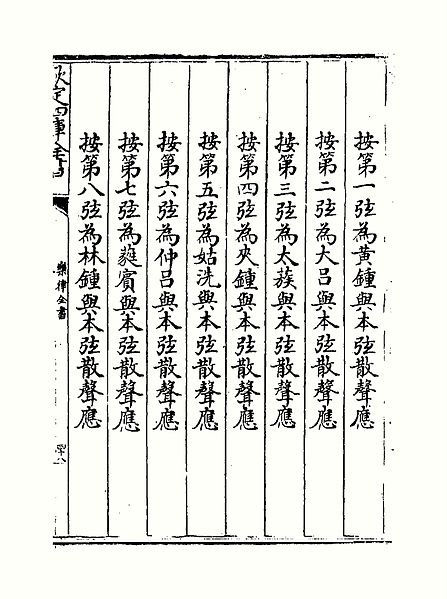
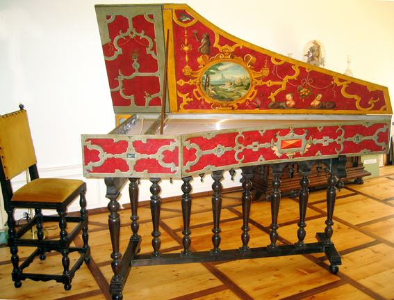
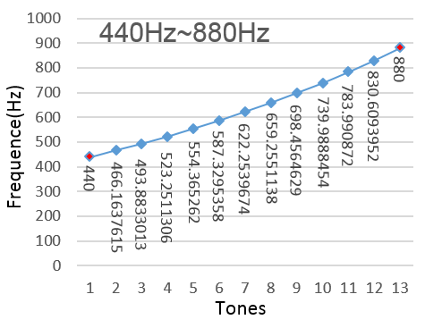
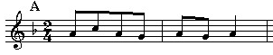
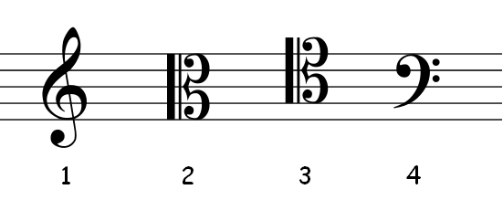
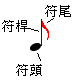
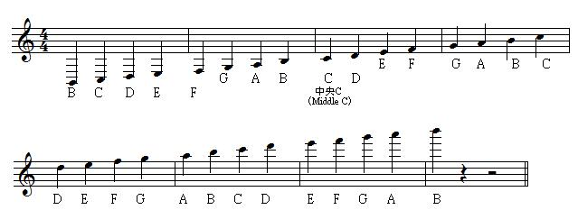
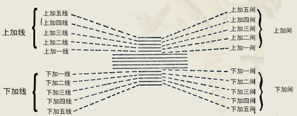
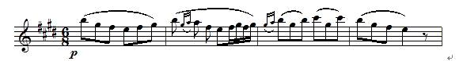

# 十二平均律与五线谱入门

[TOC]

在第一讲中我们已经提到了纯八度（中央do和高音do），想必朋友们已经用耳朵有了感性的认识，并知道纯八度的拍音是由频率比为1:2的两个单音构成。物理和数学的原因决定了纯八度的两个单音的频率比例，但这远远不足以构成音乐的，接下来我们就要学习如何在这两个单音之间产生更多的单音。在展开这些知识之前，本着理工科追本溯源的精神，我们先了解一下乐理是如何发展起来的，然后再谈理论。

 

## 一、乐理发展史 · 之一

人类的三大类乐器类别：弦乐，管乐和打击乐有其分别的来源，但音律系统则基本上是从音调变化最丰富的弦乐上发展起来的。弦乐就是利用琴弦的振动发出声音，琴弦振动部分的长短、粗细、质量、密度等因素综合决定了它振动的频率。一般来讲两根同质琴弦的长度比等于它们所发出声音频率的反比，这成为了制定音律标准的最佳性质。

 小提琴琴弦的振动（慢镜头）

要使不同的音组合在一起形成音乐，必须定出这些音的相对音高，并将悦耳动听的音进行组合；此外还要定出绝对音高，使同一首音乐到哪里演奏都有相同的效果。因此早期的人们以一根固定长度的琴弦为准，将其作为标准音高，然后用各种不同的比例切分这根琴弦，从而得到了多种不同的音高。这些音律的具体制定过程我们留到后文再行说明。

为了便于记录和表达这些音高，人们发展出了表示**相对音高**的十二平均律系统和表示**绝对音高**的五线谱系统。这些音律系统历经上千年的变革与改进，并随着数学水平的发展不断提高而趋于稳定，最终形成如今庞大而复杂的理论体系。后文的相关内容也是围绕相对音高和绝对音高两大系统展开的。

目前世界上最通用的音律体系——十二平均律的历史非常悠久，最早可以追溯到公元400年左右的中国人何承天。公元16世纪的明朝人的朱载堉（朱元璋的九世孙）将十二平均律发展为完整的理论水平，到16世纪末，由当时教皇国的传教士利玛窦将十二平均律法从中国带回西方，直到17世纪才开始在欧洲大陆广泛流传。中国人发明了十二平均律，但中国文明自清朝开始的衰落，使得中国古典音乐的理论水平与西方音乐的差距越来越大，直到没落于下里巴人。

图1 明代朱载堉的《乐律全书》中对十二平均律的记载

当西方有了十二平均律这一黄金律法，新的和声理论、自然调式（念“Diao Shi”，不念Debug）和各种相关调性也就随之产生了，而这些系统则几乎全是由西方发展出来的。我们目前听到的所有古典音乐和现代音乐（包括流行、摇滚、歌舞剧）都是基于西方的音乐理论。

西方古典音乐（[维基百科](http://zh.wikipedia.org/wiki/%E5%8F%A4%E5%85%B8%E9%9F%B3%E4%B9%90)）可以说发源于文艺复兴时期（1400年到1600年），在文艺复兴时期结束时，音乐艺术已经有了长足的发展。人们获得了改进的和新发明的各种乐器，   比如新式的小提琴、羽管键琴（也叫大键琴，是钢琴的前身）、双簧管（尚未从萧姆管中完全脱胎）等等。还得到了新的演奏和作曲技法，比如更复杂的和声技巧，对位法技巧等等。当然，还有最重要的东西：五线谱。在文艺复兴时期之后的巴洛克时期，这些新玩意帮助音乐家们进一步的挖掘音乐理论层面的东西，现代乐理就是在这一时期逐步发展完善的。

图2 一台巴洛克时期的羽管键琴

西方音乐长期以来都是为教会服务的，西方宗教也非常重视音乐艺术的发展。音乐课是教会学校的主要课程，很多音乐理论也都来自于教会音乐家。当时的调式系统称作“古教会调式体系”，一共有12种，现在只有少数仍在使用，包括对应自然大调的“伊奥尼亚”调式和对应自然小调的“爱奥尼亚”调式。关于调式与调性的知识，会在后面的内容中做进一步介绍。

历史课就暂时上到这里，下面我们开始分别介绍十二平均律和五线谱。

 

## 二、十二平均律

十二平均律（[维基百科](http://zh.wikipedia.org/wiki/%E5%8D%81%E4%BA%8C%E5%B9%B3%E5%9D%87%E5%BE%8B)）是音乐中最底层的系统，规定了两个单音的**相对音高**，就像计算机中的二进制系统规定了各种运算方式一样。简单来讲，十二平均律体系将一个“纯八度”（暂不理会为什么叫做“纯八度”）分成12份，每份称为1个半音，两份为1个全音，以此定出所有中间的单音。现在我们有了好几个需要定义的名词，下面将是一大堆严谨的数学定义，但是作为理工科人的我们还怕这些吗？

为了表示相对音高，首先要给出音程的概念：**音程**就是两个音之间的频率差距，用**音数**来衡量。频率不同则音不同，而从数学上讲频率是连续的，因此音也是连续不可数的。但是十二平均律系统规定了离散的音的产生方法，这样我们就可以“数出”音程了。

上节课我们已经学到频率比为1:2的两个单音之间的音程被定义为“纯八度”，例如某个单音的频率为f，那么它与频率为2f的另一个单音之间就构成了一个“纯八度”音程。按照十二平均律系统，我们可以以f为基准音，在区间[f,2f]内得到13个不同的单音，它们的频率分别为：f×2112

，f×2212

，…，f×21112

，f可以视为f×2012

，2f可以视为f×21212

。如果将f设定为440Hz，从f到2f这13个单音的频率就可以用前述公式算出，把它们画在坐标系中如图3所示。

图3 440Hz到880Hz的“纯八度”音程中的13个单音

注意每两个相邻的单音之间是等比关系，比例是2–√12

，因此它们所构成的是一条指数曲线。根据上述方法，给定任意基准频率f，我们都可以在区间[f,2f]中构造出13个单音。十二平均律系统规定**任两个相邻的音之间的音数为0.5**，那么给定两个音的音程为t（即两音之间相隔的音的数量*0.5）和较低的一个音的频率为fa

，我们就可以算得较高那个音的频率fb

：fb=fa×22t/12=fa×2t/6

。13个单音之间不同的音程一共只有12种，人们给它们都起了名字：

| 相差音数 | 0.5        | 1          | 1.5        | 2          | 2.5        | 3          | 3.5        | 4          | 4.5        | 5          | 5.5        | 6          |
| -------- | ---------- | ---------- | ---------- | ---------- | ---------- | ---------- | ---------- | ---------- | ---------- | ---------- | ---------- | ---------- |
| 音程名称 | **小二度** | **大二度** | **小三度** | **大三度** | **纯四度** | **三全音** | **纯五度** | **小六度** | **大六度** | **小七度** | **大七度** | **纯八度** |

我把这些音程名称都标记为红色，就是为了提醒大家：整个乐理中有半数以上的内容都和音程相关，因此**必须记住**这些音程名称和对应的相差音数，否则后面的内容无法开展。

为了方便描述，我们将音数为1的音程称为全音，将音数为0.5的音程称为半音。由此可知：小二度到大二度是1个半音，小三度到纯四度是1个全音，纯五度到纯八度是2个全音加1个半音，等等。实际上，每一个音程还有其它的名称，这叫做“异名同音”。例如小三度又称为增二度，大六度又称为减七度等等，有兴趣可参见维基百科：[音程](http://zh.wikipedia.org/wiki/%E9%9F%B3%E7%A8%8B)。音数更多的音程也是存在的，但一般很少用到。

上面所述的相关概念都是关于相对音高系统的，也就是说十二平均率规定了音与音之间的频率比例。接下来要讲解内容就和绝对音高相关了，我们将使用一种新的语言来描述，那就是五线谱。

 

## 三、五线谱入门

五线谱是一种音乐语言，可以用来记录几乎任何形式的音乐。五线谱中记录的最主要的东西就是**音符**，一个音符表达一个单音，每一个音符都具有绝对的音高。也就是说五线谱上的同一个音符在不同乐器上演奏出来的音高是相同的（忽略调校的差异）。

图4 《北京欢迎你》（部分）

 

图4所示为一个简单五线谱，五根线从低到高分别称作第一线、第二线、第三线、第四线和第五线。五根线中间的四个区间分别称为第一间、第二间、第三间和第四间。这些“线”和“间”都对应不同的音高。从理工科观点来看，一条五线谱是一个二维直角坐标系，从下到上是频率轴，从左到右是时间轴。

图4最左边的符号是高音谱号，现在常用的谱号只有四种：高音谱号、中音谱号、次中音谱号和低音谱号，这里先介绍最常用的高音谱号。高音谱号代表该五线谱是一个高音谱，即确定了标记在线和间上的音符的音高。高音谱号中间的那个圈的圆心表示一个称作G的音的位置，而高音谱号本身也是由大写字母G演化而来的。历史上还出现过位置更靠下的高音谱号，不过现在已经不再使用了。

图5 常用的四种谱号

再看图4所示的乐谱，高音谱号的右边有一个b，这叫做降号，它画在第三线上表示该谱的调性是F大调。降号的右侧有两个数字：2和4，它们表示节拍，即以四分音符为1拍，每小节2拍。乐谱的中间和末尾处有两条切断五条线的竖线，这是小节标记，两条竖线之间是一个小节（高音谱号视为第一个小节的开始）。小节和节拍都是和节奏相关的东西，先混个眼熟即可。

线上和线间的音符标记是由一个黑豆、一条短竖线和连在短竖线一端的波浪线构成，见图6所示。

图6 音符的画法

黑豆称为符头，短竖线称为符杆，波浪线称为符尾，符头和符尾分别画在符杆的上下两端。可以符头在上符尾在下，也可以反过来，这是由符头在五线谱中的高低位置决定的。如果符头位置较高，就应画在符杆下方。应当注意的是还有一种音符没有符尾；还有一种音符连符杆都没有，用圆圈表示符头；一些音符的符尾还可能连在一起，形成一条粗横线，这些都和音符的时长有关，我们现在只关心符头的高低位置，也就是音符的音高。

五线谱中的每个音符都有一个名称，即音名。音名一共有7个，每个音名又对应一个唱名，它们分别是：

| 音名 | A    | B    | C    | D    | E    | F    | G    |
| ---- | ---- | ---- | ---- | ---- | ---- | ---- | ---- |
| 唱名 | La   | Si   | Do   | Re   | Mi   | Fa   | So   |

唱名是由一位意大利音乐理论家桂多·达莱佐从一首拉丁语圣歌的歌词中抽取出来的。而音名则是由后来的英国人嫌拉丁唱名太麻烦，就用英语字母代替了。但过去无论是过去还是今天，A都是基准音（与主音概念不同，注意区别），ABCDEFG这样7个音连在一起形成的音阶称为“小调音阶”，不过后来大调比小调更为普及，便趋向于使用“大调音阶”（CDEFGAB）的主音C作为一个纯八度音程的开始。显然，人们使用的全部音符数远多于7个，因此唱名及其音名是循环使用的。五线谱中的所有音符的音名如图7所示。

图7 五线谱表达的所有音符

如果音符过高或过低，在五条线中画不下了，还可以在五根线的上面或着下面加线，这些线叫做“下加X线”和“上加X线”，X可以是“一”、“二”、“三”……。比如图7最低的音B就画在“下加五线”上。

图8 五线谱的表示范围

注意相邻的同名音符之间的音程是八度……等等，八度？难不成是第一节课讲的……？嗯，说对了，第三间的C比下加一线的C的频率的确高了一倍！再高一倍我们还可以得到上加二线的C。从图7的谱号可知这是一个高音谱，人们规定高音谱中第二间的La，也就是图中上面一排倒数第三个音符A，**频率是440Hz**。以A为基准，其它音符的频率就可以用十二平均律系统从中音A推算出来了，这就是基准音A的概念。然而此时我们还没有学习五线谱中各音符之间的相对音高，这一部分内容留到下一讲。

格里格《培尔金特》选段

上面这个五线谱就要复杂得多了。高音谱号的后面有4个#，这是升调号，对应的调性是E大调。节拍是6/8拍，即以八分音符为1拍，每小节6拍。下面的P为强弱标记，表示演奏的力度（音量大小），而音符上面的弧线则是延音记号，与演奏技法相关。最后有一个特殊符号，称为休止符。五线谱里的名词还有很多，就像我们计算机语言中的语法是非常丰富的。更进一步的内容下一讲再说。

 

## 四、总结

这一讲我们学习了两种音律系统，一种是定义单音之间相对音高的十二平均律，另一种则是定义了单音的绝对音高的五线谱系统。这里面确实有很多数理逻辑的东西，具有一定的难度，要想理解透彻还需要仔细阅读和思考。感到困难了吗？请坚持下去，我会尽量让这些知识组织得更符合理工科人学习新事物的习惯。全部乐理知识计划用十讲左右讲完，为了讲得清晰准确，写一篇要花比较多的时间。我平时也很忙，只能抽空来写，因此最快也只能一天一篇。请大家有些耐心，见谅。

好了，就到这里，下一讲将深入五线谱，以及和声与和弦理论。最后以一首舒伯特的《鳟鱼五重奏》第四乐章作为结束，请欣赏五位大师帕尔曼（小提琴）、杜普蕾（大提琴）、祖宾梅塔（低音提琴）、祖克曼（中提琴）、巴伦勃依姆（钢琴）的辉煌演绎。