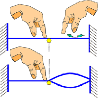
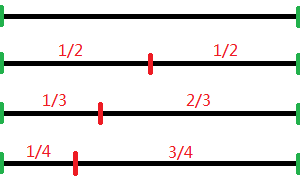
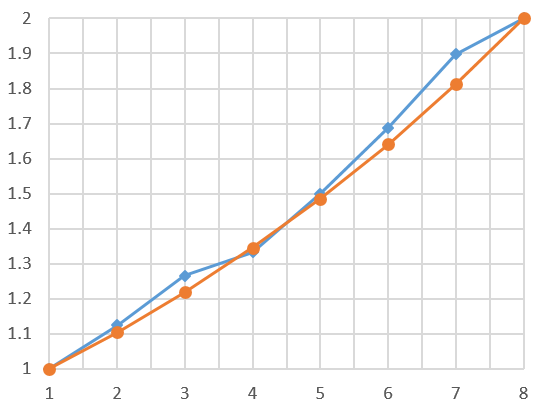
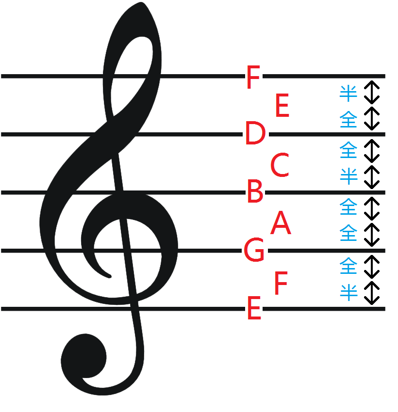
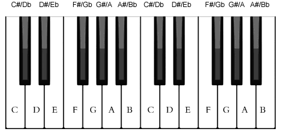
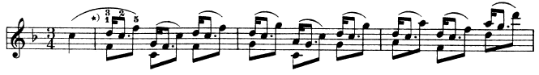
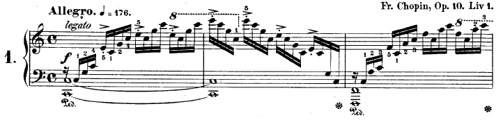
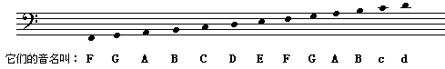

# 五线谱进阶与声学理论

[TOC]

上一讲我们学习了表示音符相对音高的十二平均律系统和表示绝对音高的五线谱系统，这一讲将对我们已经学到的这些知识做进一步展开，并对和声理论做简单的介绍。和上一讲一样，我们先从历史开始讲起。

## 一、乐理发展史 · 之二

人们很早就发现长度比为1:2的两根弦同时拨响可以发出非常协调的声音，但仅仅使用2倍关系的弦长所构造出来的音过于单调了，可以说根本不足以形成音乐，因此人们就尝试用其它的弦长比来发声。一根固定在平面上的弦如果从中间任意位置按在平面上，就形成了左右两段成不同长度比且可以分开振动的弦，人们就是用这种方法尝试不同的弦长比的。

图1 弦长的分割（左手按下，右手拨动）

我们把原弦长所发出的频率记为f。用手指按在弦的正中间，即1/2处，形成的两段弦长是相等的，它们发出的声音频率都为2f，这样纯八度音程就形成了。接下来人们尝试在纯八度音程的中间找到其它的音，首先按在弦长的1/3处，在较长的那一段人们听到了一个新的音，它的频率是3f/2，听起来与f非常协调。信心满满的人们接下来又尝试按在弦长的1/4处，但较长那一段的音听起来虽没有前一个音程那么协调，但也挺不错，它的频率是4f/3。用同样的方法人们又得到5f/4、6f/5、7f/6……然而，人们很快就遇到了麻烦：首先，新得到的音的频率与f的叠加变得越来越不协调（其原因将在下文“和声”部分详细说明）；其次，新产生的音与前一个产生的音之间也不存在任何协调关系，这样下去是不可能产生悦耳动听的音乐的。人们只能另辟蹊径。

图2 三种最简单的分割

不过这时人们已经获得了3种最简单也最重要的弦长比，分别是1:2、2:3和3:4，它们来自于3个不同的分割点。为了获得新的频率，又要与f或之前已产生的频率保持协调，那么能否以这3种分割点为基础，从较长的那一段再以同样的比例继续细分呢？当然是可行的，因为协调性可以传递！1/2即是原弦长的一半，再将其细分为1/2就得到原弦长的1/4，协调性没问题，但这仍然是纯八度音程，没有出现新的音程。而从2/3处再细分情况就大不相同了，2/3再细分2/3，就得到了与原弦长比为4:9的长度。9f/4是一个全新的频率，显然它与3f/2的协调程度和3f/2与f的协调程度是相同的。再从4/9中分割出2/3，得到频率27f/8……一直用(2/3)n

切分下去就得到了如下的频率序列：

| n    | 频率    | 倍率    |
| ---- | ------- | ------- |
| 1    | 3f/2    | 1.5     |
| 2    | 9f/4    | 2.25    |
| 3    | 27/8    | 3.375   |
| 4    | 81f/16  | 5.0625  |
| 5    | 243f/32 | 7.59375 |

上表中的“倍率”是指其频率除以f的值。然而这样找音存在一个问题，那就是后面产生的音已经超过以f开始的一个纯八度音程了。我们把这5个音和4f/3一并标记在数轴上，如图3所示。

 图3 7个音所隶属的八度音程

看以看出，这6个音（黑x表示）分别隶属于3个不同的纯八度音程（红x表示）。4f/3和3f/2隶属于[f,  2f]，9f/4和27f/8隶属于[2f, 4f]，81f/16和243f/32隶属于[4f,  8f]。既然我们要确定的只是一个纯八度音程中的相对位置，那最简单的办法就将这6个音的频率都除以所在纯八度的最低频率。这样得到的新的6个倍率，从小到大排列<1.125 1.265625 1.333 1.5 1.6875 1.8984375>。f自身的倍率为1，2f为2，把这8个倍率一起画在二维坐标系中，见图4所示。

 

图4 7音阶折线（蓝色）与理想指数曲线（橙色）对比

挺奇妙的不是吗？与理想的指数曲线相比误差并不大。这不仅意味着音和音之间存在协调关系，而且按这样的倍率关系，从任意置开始的连续7个音都能形成一条听起来相当不错的音阶。这就是7音阶的来历。这种方法由f产生的第1个音是3f/2，除4f/3之外的其它因都是由3f/2产生，而f到3f/2是纯五度关系，因此这个方法被人们称为“**五度相生律**”，世界历史上多个民族都独立发明出五度相生律，但一般认为最早是由古希腊哲学家毕达哥拉斯提出的。

 然而，随着音乐水平的不断发展，这7个音慢慢变得不够用了，而且相邻两个音之间的频率比并不统一，跟不上乐器音准的提高速度。因此后来人们又发明出了十二平均律系统，直到现在7音与12音并存的局面。篇幅关系，12音阶的来历我们放在下一次历史课上讲解。下面的内容我们会学到关于五线谱的新知识，并以此为基础了解到为什么有的音程听起来协调，而有的不协调，这些都是和声理论要研究的内容。

 

## 二、五线谱进阶

### 1. 五线谱中的相对音程

上一讲我们已经知道了高音五线谱中，第二间的A的音高定为440Hz，那么我们如何来确定其它音的音高呢？下面将会按照十二平均律的法则在五线谱中建立相对音高系统，请看图5。

图5 放大的没有任何升降标记的高音谱

上图是一个放大的最简单的高音谱，可以看到第一线上的音名是E，第一间的音名是F，其它以此类推。右侧的“全”和“半”表示相邻两个音符之间的音程是全音还是半音。至于为什么是这样规定的，我们会在下一讲《调式与调性理论》中进一步展开。确定了音符之间的相对音程，并确定了一个基准音高A，我们就可以开始推算所有其它单音的频率了。

首先为了方便的表示众多音符，下文将使用科学记音法（见[维基百科](http://en.wikipedia.org/wiki/Scientific_pitch_notation)）来表示所有的音符，即两个字符表示一个音：XN。其中X为音名，可以是{C,  D, E, F, G, A,  B}中的任意一个；N为该音的序号，从0开始由低到高编号。N每增加1，音的频率就翻倍，并规定第C4位于高音五线谱的下加一线。根据科学音调记号法，高音谱下加一线上的C记作C4，往高依次是D4，E4，F4……往低依次是B3，A3，G3……。所有的C音在五线谱上标记如图6所示。

 图6 五线谱上所有C音的音符

比A4低纯八度的音符是A3，其频率为A4频率的一半，即220Hz，比A4高纯八度的音符是A5，频率为A4频率的二倍，即880。A0到A7间所有A音的频率见下表：

| 基准音名 | A0   | A1   | A2   | A3   | A4   | A5   | A6   | A7   |
| -------- | ---- | ---- | ---- | ---- | ---- | ---- | ---- | ---- |
| 频率(Hz) | 27.5 | 55   | 110  | 220  | 440  | 880  | 1760 | 3520 |

要计算其它音符XN的频率fX

，则应以XN下方的第一个A音AN'的频率fA

作为基准，然后算出XN与AN'之间的音数t，那么XN的频率为：fX=fA×22t12=fA×2t6

。例如，由于第三间的C音（即C5）与其下方第一个A音，即A4之间的音程是小三度，音数t=1.5，因此C5的频率为：440×21.56≈523.25113Hz

。当然，也可通过纯八度音程的倍率关系计算，比如C4的频率为C5的1/2，约为261.62557Hz。

### 2. 升降记号

五线谱中，音符的后面可以添加升降标记，表示该音符升高半音或降低半音。升号为#，降号为b。显然，有两个音是没必要升的：E升半音就是F，B升半音就是C，而这就是钢琴键盘布局形成的原因。如下图所示：

 图7 钢琴键盘中部分键位的音名（下面是白键音名，上面是黑键音名）

钢琴上的黑键比左边的白键高半音（也可以说是比右边的白键低半音），因此白键B和E的右边就没有黑键。此外，所有的降音都可以由另一些音的升音代替，比如Bb就是A#，Gb就是F#。那既然如此，为什么不用升号代替全部的降号呢？原因就是为了可读性，正如写代码时不能为了减少代码量就把所有的if语句都换成三目运算符。

如果一段谱子中的某个音符几乎都要升半音或降半音处理，那就可以在高音谱号的右侧，这个音符所在的一条线或一个间上标记升降号。

图8 肖邦《练习曲 Op.25》第3首选段（略有删改简化）

在图8所示乐谱中，第三线上标记了一个降号b，表示这个谱子里的所有B音都需降半音，除非另外在个别音符上标记升降或还原记号。音符被升降半音后的频率可根据之前学过的相邻音符之间的频率倍数关系计算。升高半音后的频率为原频率的2–√12

倍，降低半音后的频率为原频率的1/2–√12

倍。比如C5升高半音的频率即为523.25113×2–√12≈554.3653Hz

。

### 3. 双音谱

 

图9 肖邦《C大调练习曲》选段

图9是一个钢琴谱，这下我们终于见到了高音谱号和低音谱号并存的样子了。标有高音谱号的上面一排是高音谱，标有低音谱号的下面一排是低音谱，它们分别对应钢琴健盘上不同的键区。低音谱的“线”和“间”所对应的音符与高音谱不同，如图10所示：

图10 低音谱各音符及其音名

其实低音谱中的音名也没有那么难记，实际上它和高音谱是相互连接的，中间刚好只隔了一条加线。高音谱的下加一线就是低音谱的上加一线，而这条线上的音就是中央C，即C4。和高音谱号类似，低音谱号的圆心标记的是F3在谱中的位置，即第四线上。

低音谱中各音的频率计算与高音谱是相同的，只要搞清音程关系，从基准音推算即可。比如在前面的钢琴谱中可以看到低音谱的最左端有两个C（它们是用圆圈表示的），一个是第二间的C3；另一个是下加二线上的C2。C3和C2的频率分别为C4频率的1/4和1/8，而C4的频率在前面已经计算过了。

利用上面的知识，你已经可以计算任何一个五线谱中每个音的频率了，八度音程中各音之间的音程可参见[第五讲](http://www.cnblogs.com/devymex/p/3391069.html)后面给出的[音程表](https://images0.cnblogs.com/blog/129662/201310/28211513-457d45af7d81487983078e14f8761914.png)。那么接下来我们介绍对一些特别的频率进行合成的问题——和声。

 

## 三、和声

**和声**，是指由超过一个单音所组合而成的声音。你可能会发现，和声的定义与拍音的定义是非常相似的。的确如此，所有的拍音都是和声，但和声不一定会产生拍音。首先，人耳可以听到的声波频率范围大约为20Hz到20000Hz，如果和声产生的频率超过这个范围，通常就不能称之为拍音了。其次，不同的乐器发出的单音进行叠加也可以称为和声，这也不是拍音。最后，拍音要求所有单音同时发出，而和声则无此要求，只要一个音在另一个音结束之前发出，它们交叠的部分就形成了和声。

肖邦《C大调练习曲》的前两个小节，[下载收听](http://files.cnblogs.com/devymex/chopin.7z)。这是由一架钢琴演奏的曲目，前两个小节的乐谱在本讲第一节中给出。一开始的那个低沉的重音就是C3和C2的和声。朋友们可以在[在线钢琴](http://www.onlinepianist.com/virtual_piano/)上试着弹一下C3和C2这两个单音的和声（对应键盘上左起第1个键和第8个键）。乐谱中这个和声从一开始延续到了第二个小节结束，在这期间，钢琴还奏出了一共31个音符，这每一个音符与持续的低音和声又形成了更复杂的和声。下面请收看《C大调练习曲》的完整版，请朋友们注意钢琴家的左手总是保持按下的状态，都是在利用声音的延续制造和声。

 

瓦伦蒂娜‧乌拉索娃演奏，肖邦《C大调练习曲》

在西方古典音乐理论中，和声主要研究两个单音构成的和声，三个或以上单音构成的和声一般称为和弦，我们放在下一节讨论。在一个纯八度范围内，两个单音的和声一共有12种，即与12种音程相对应。在钢琴键盘上以中央C键，即C4为准，请试听一下C4分别与D4、E4、F4、G4、A4、B4以及C5键同时按下的和声效果。听过以后有没有发现某些和声比较悦耳，而某些则比较难听？比如C4和C5同时按下（纯八度音程）的和声就毫无违和感，就像只有一个音；而C4和D4同时按下（小二度音程）就非常刺耳难听。这究竟是为什么呢？

图11 钢琴键盘与五线谱对照图

就是因为拍音！上一讲我们学到，相邻两个音之间的频率比为2–√12≈1.059463

，我们将这个数记为p，那么各音程的频率比（即相距某个音程的低音比高音）可由其音数t按公式：1/(2t)p

算得。由于除纯八度外的所有音程的频率比均为无理数，因此他们的拍音的频率只能按他们频率的近似整数比来计算，详见第一讲第三节。计算近似整数比的数学过程是比较复杂的，这里篇幅有限，不做进一步的讨论。接下来我们分别换算一下12个音程的频率比。

| 音程   | 近似频率比 | 近似整数比 | 最小公倍数 |
| ------ | ---------- | ---------- | ---------- |
| 小二度 | 1:1.06     | 15:16      | 240        |
| 大二度 | 1:1.12     | 8:9        | 72         |
| 小三度 | 1:1.19     | 5:6        | 30         |
| 大三度 | 1:1.26     | 4:5        | 20         |
| 纯四度 | 1:1.34     | 3:4        | 12         |
| 三全音 | 1:1.41     | 7:10       | 70         |
| 纯五度 | 1:1.50     | 2:3        | 6          |
| 小六度 | 1:1.59     | 5:8        | 40         |
| 大六度 | 1:1.68     | 3:5        | 15         |
| 小七度 | 1:1.78     | 5:9        | 45         |
| 大七度 | 1:1.89     | 8:15       | 120        |
| 纯八度 | 1:2        | 1:2        | 2          |

按近似整数比的最小公倍数排序，可以得到如下和声序列：<纯八度，纯五度，纯四度，大六度，大三度，小三度，小六度，小七度，三全音，大二度，大七度，小二度>

通过在钢琴上弹奏对比可知，越向左边的和声越“协和”，但也越空洞，就是好像只有一个音，不够饱满；越向右边的和声越“难听”，但也越饱满。人们根据这一特征，将和声的协和程度分为“极完全协和”、“完全协和”、“不完全协和”、“不协和”与“极不协和”五类，如下图所示：

图12 各音程的协和程度

我们做一个实验来验证。比如C4和G4之间是完全协和的纯五度，他们的弦长比是3:2，最小公倍数是6，那么他们的拍音频率就是弦长为C4弦长2倍的弦所发出的声音的频率，显然就是C3的音。我们可以在[在线钢琴](http://www.onlinepianist.com/virtual_piano/)上同时按下i（C4）和x（G4）键，然后试着同时按下i、x和q（C3）键听一听效果。可以感觉到C4和G4把C3增强了。同理，A6和B6这两个小二度音程的弦长比是16:15，最小公倍数240，拍音频率对应的音为B2，然而B2与A6和B6相隔太远了，我们无法听出拍音增强的效果。

和声理论已经发展为一门学科，称为和声学，内容是相当复杂的，这里只做简单的科普性介绍，感兴趣的同学可以阅读《和声学》。

 

## 四、总结

这一讲的内容是所有乐理中最复杂，也最困难的。但只要过了这一关，后面的内容就会轻松很多了。今天就到这里，最后给大家放一点福利，教你如何在2分钟内学会弹钢琴。玩笑归玩笑，也请各位结合本讲的内容，思考这里面的原理。