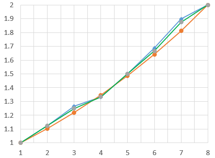
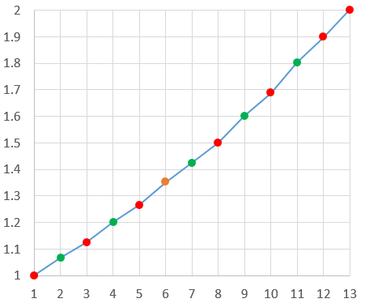
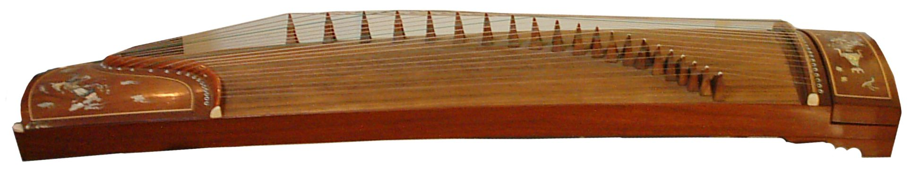
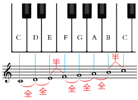
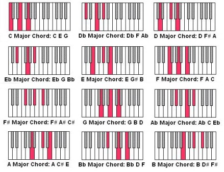
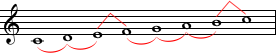
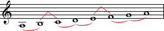

# 和弦与调式

[TOC]

通过前面的课程的学习，我们已经掌握了计算五线谱中任何一个音的音高（频率值），并且学习了音的组和方法：和声。这一讲将以这些知识为基础来介绍和弦与调式理论。这些内容中数理方面的并没有之前的课程那么多，但感性的成份却是比较丰富的，且要求记忆的东西也多了一些。不过，仍然先是历史课。

 

## 一、乐理发展史 · 之三

上一次的历史课已经研究了人们是如何用五度相生律构造出7音阶的过程，并知道这7个音分别是：{1, 1.125, 1.265625, 1.333, 1.5, 1.6875, 1.8984375}，它们对应的音名是：{C, D, E, F, G, A, B}。后来人们不断的改进音阶的生成方式，并增加纯八度音程内的音数，直到十二平均律这一黄金律制产生。今天我们就来研究7音阶是如何演化为12音阶的。

随着制作工艺的不断进步，乐器的音准越来越高，人们慢慢意识到五度相生律产生的7音阶与理想曲线相比误差实在是太大了。我们现在知道，当相邻的音都为等比关系时，音阶才最平滑。而原始7音阶中的第3个音和第7个音看起来是那么突兀，这样构造出来的音乐确实不够好听。后来有人提出“纯律”学说，但究竟是谁最早提出的至今还存在争议。有人认为纯律和五度相生律都是毕达哥拉斯提出或整理的，也有人认为纯律在中国2400年前的战国时代就已开始应用，还有人说是古希腊学者亚理斯托森努斯发明……不过可以肯定的是纯律在2000多年前就已被人类所掌握。纯律构造音阶的方法与五度相生律不同，它是由纯五度（2:3）和大三度（4:5）为素材确定7音阶的律制。纯率生成的7个音的频率分别是：{f,  9f/8, 5f/4, 4f/3, 3f/2, 5f/3,  15f/8}。嗯，确实比五度相生律的那些巨大的分数简单多了，那他的平滑度怎么样呢？请观察图1。

图1 五度相生律音阶（蓝），纯律音阶（绿）和理想音阶（橙）对比

好是好点，不过就那么一点点而已，而且还打破了五度相生律产生的内部协调性。此外7个音也开始显得不够用了，人们希望通过变调使得音乐更加丰富，看来还得继续探索。

之前人们为了计算第7个音，就要计算2/3的5次幂，这对于2000多年前的计算水平来说确实有点难了。然而数学的发展又一次给音乐带来了新生。人们通过计算发现，2/3的12次幂约为129.74634，约等于基准频率f上面的第7个八度音的频率f×28=128f

，那么可否继续应用五度相生律再产生一些音呢？看下表：

| n    | 频率        | 倍率    |
| ---- | ----------- | ------- |
| 1    | 3f/2        | 1.5     |
| 2    | 9f/4        | 2.25    |
| 3    | 27/8        | 3.375   |
| 4    | 81f/16      | 5.0625  |
| 5    | 243f/32     | 7.59375 |
| 6    | 729/64      | 11.3906 |
| 7    | 2187/128    | 17.0859 |
| 8    | 6561/256    | 25.6289 |
| 9    | 19683/512   | 38.4434 |
| 10   | 59049/1024  | 57.6650 |
| 11   | 177147/2048 | 86.4976 |

由这些倍率产生的12音阶为（用倍率除以它下面的第一个2n

而得）：{1, 1.0679, 1.125, 1.2014, 1.2656, 1.3515, 1.4238, 1.5, 1.6018, 1.6875, 1.802, 1.8984}，把他们画在坐标系中，请观赏图2。

图2 五度相生律产生12音阶（新产生的五个音为绿色）

震惊了吗？多么平滑的一条折线，而且新产生的音都被“均匀”地安插在了原先的7音阶中间。我们不得不惊叹造物主的神奇，这也是音乐是世界上唯一通行的语言的原因吧！由于之前的七个音和它们的音名{C,  D, E, F, G, A, B}已经非常流行了，且新产生的音都可以看作是用原7音阶中的某个音升半音而得，因此这5个新产生的音就被叫做{C#,  D#, F#, G#, A#}，这也正是为什么E和F、B和C之间是半音的原因。

看起来已经很完美了，还有改进的空间吗？答案是有的。尽管五度相生律生成的12音阶已经相当平滑了，但仍然不是理想的“等比”音阶，这样就会导致一个潜在的问题。我们举例来说，大家都在KTV唱过歌，应该知道有些KTV的点播机有升降音的功能，当伴奏比较高而人声又吼不上去时，可以用降音功能把伴奏的音高统一降低一些，这样听起来仍然是非常自然的。比如一首歌原先的音的序列是<E  F G G F E>，降低半音就是：<D# E F# F# E  D#>。听起来仍然非常自然的原因在于这一序列内部的音程比例关系没有变，仍然是以2–√12

为基准的。在音乐术语中，这个过程叫做转调。然而要在五度相生律生成的12音阶系统中进行转调就会产生偏差，因为它内部的音程比例关系不是固定的。设想一群乐师给皇帝演奏曲目，乐器的音准都是预先调好的，结果皇帝一时兴起想高歌两句但又唱不上去高音，就命令乐师低两个音演奏，结果听到的伴奏完全不是刚刚那么回事了，这是多么尴尬的一件事。

 图3 至今仍有一些古老的乐器难以实现转调

后来人们又想出了各种修正的办法，比如构造一些等差数列来修正每个音与理想曲线的误差等等，但这些方法既复杂又不能从根本上解决问题。这时整个音乐界都在急迫的等待新律制的诞生。直到公元17世纪的明朝人朱载堉提出十二平均律，并由利玛窦带到西方，才拯救西方音乐界于水火之中。虽然十二平均律看起来那么完美，但也不是完全没有问题。有人认为十二平均律破坏了纯四度和纯五度的协调关系，也就是说我们之前讲的F音应该是C音频率的4/3=1.33333倍，G音应该是F音的3/2=1.5倍，而在十二平均律中它们的倍率分别是：2512≈1.33484

和2512≈1.49831

。其实所差无几，不是吗？在通常的演奏音域范围内，人耳几乎是不可能听出这些区别的，这也是十二平均律沿用至今而五度相生律和纯律都已遭淘汰的原因。

世界三大律制：五度相生律、纯律和十二平均律的故事就讲完了，今天的历史课可能有点枯燥，我们来听点音乐调节一下吧：

郎朗演奏肖邦《英雄波罗乃兹》

 

## 二、和弦

**和弦**（念“xian”，不念“xuan”，通常发儿化音）原指弦线，在音乐理论里，是指组合在一起的两个或更多不同音高的音。在欧洲古典音乐及受其影响的音乐风格里，更多时候是指三个或以上的音高组合。和弦的组成音，可分开演奏，亦可同时演奏。分开演奏的，我们称为分解和弦。

和弦的结构类型很多，如果按照组成音的多寡来区分，和弦可以分为三和弦、七和弦及九和弦等。三和弦是由三个音组成，七和弦是由四个音组成，九和弦则由五个音组成。如果按照和弦组成音之间的音程结构来分类，又可分为大和弦、小和弦、增和弦和减和弦四种形态。

### 1. 三和弦

以任意一个音n1为基准，称为**根音**，向上三度得到n2，向上五度得到n3，这三个音的和弦称为三和弦。三和弦可以再分为大三和弦、小三和弦、增三和弦和减三和弦。这些三和弦的构成如下表所示：

| 名称     | [n1,n2] | [n1,n3] |
| -------- | ------- | ------- |
| 大三和弦 | 大三度  | 纯五度  |
| 小三和弦 | 小三度  | 纯五度  |
| 增三和弦 | 大三度  | 增五度  |
| 减三和弦 | 小三度  | 减五度  |

上表中[n1,n2]表示从n1到n2的音程，[n1,n3]表示从n1到n3的音程。注意增五度就是小六度，减五度就是三全音，这是在上一讲中提到过的异名同音现象。接下来我们就用钢琴的音阶来举一些三和弦的例子。

图4 钢琴白键之间的音程

如果你已经完全理解了上一讲的内容，很容易就可以推算出图3所示的对应关系。C和E两键之间共有两个全音，因此是大三度，C和G是纯五度，那么C、E和G三个白键就构成了大三和弦，请在[在线钢琴](http://www.liangangqin.com/)上试弹（对应键盘上的T、U和O）。C和Eb（E左边的黑键）是小三度，那么C、Eb和G三个键构成了小三和弦（在线钢琴的黑键可以用鼠标点）。同理可知：C、E和G#（G右边的黑键）构成增三和弦，C、Eb和和Gb（G左边的黑键）构成减三和弦。

需要注意的是，如果换一个音作为起始，那么和弦对应的键位就会发生明显的变化，且发出的声音色彩也会完全不同。以A为根音的大三和弦是A、C#和E，小三和弦是A、C和E，增三和弦是A、C#和E#，减三和弦是A、C和Eb。12种大三和弦对应的键位如图5所示，可在[在线钢琴](http://www.liangangqin.com/)上试弹，要按从左到右，从上到下的顺序依次试弹每个大三和弦，每个三和弦的三个音以12321的顺序按下。

 图5 所有大三和弦的钢琴键位

用电脑键盘来按键是比较方便的，如果您找不着键位，下面给出了试弹的按键序列。注意大写字母要同时按下shift键和字母键，这就是黑键的按法，空格处稍做停顿。

tuout TiOiT yIpIy YoPoY uOaOu ipspi IPSPI oadao OsDsO pSfSp PdgdP aDGDa

将每个大三和弦的n2音降半音，可得到一共12个小三和弦，它们的按键序列为：

tYoYt TUOUT yipiy YIpIY uoaou iOsOi IpSpI oPdPo OADAO psfsp PSgSP adGda

通过比对我们可以听出，小三和弦的“协调”程度不如大三和弦，这一原因请朋友们用之前学习的和声理论进行分析。增三和弦和减三和弦的情况与之类似，朋友们可以自行推算所有增三和弦与减三和弦的音名。

### 2. 七和弦

七和弦比三和弦多加一个音n4，它于n1的音程为七度。七和弦又分为：大小七和弦、大七和弦、小七和弦、小大七和弦、增七和弦、增七和弦和半减七和弦一共7种，每一种七和弦的音的配置参见[维基百科](http://zh.wikipedia.org/wiki/%E5%92%8C%E5%BC%A6)，此处不再赘述。

有了和声与和弦理论，就可以进入更高一级的主题，那就是调式与调性。

 

## 三、调式

先给出调式的定义：调式是若干个具有不同音高的音的集合，这些音互相之间具有某种特定的音程关系，并在调式中担任不同的角色。调式是决定音乐风格最重要的因素之一，调式和调性结合，决定了该段音乐所用的**调**。

现在最常使用的调式大体分为大调式和小调式两种，又细分为自然大调、旋律大调、和声大调、自然小调、旋律小调、和声小调等等，但无论哪种调式都具有7种不同的音，依次分别称为：**主音、上主音、中音、下属音、属音、下中音和下主音**，其中下主音有时也称作导音。这什么会有这样的名称呢？回顾我们上一讲提到的五度相生律就会明白：主音生属音，而中音位于主音和属音之间，主音下面是下主音、上面是上主音，属音下面是下属音，属音和下主音之间的另一个中音称为下中音。额，还是很麻烦呐，只能死记硬背了。。。不过还有另一种福音命名法：主音、I级音、II级音、III级音、IV级音、V级音、VI级音和VII级音（“福音”二字是我给起的，呵呵）。不同的调式规定了这些音之间不同的音程，但不规定音的具体音高。也就是说调式仍是建立在以十二平均律体系为基础的相对音高系统之上的。调式系统里最重要的是**自然大调**和**自然小调**，这两个自然调式一定要熟记，下面分别学习。

### 1. 自然大调

自然大调是最常见的调式，大多数流行歌曲都采用自然大调。自然大调的规则是：除了“中音和下属音”，“下主音和主音”这两对音之间的音程是小二度之外，其他相邻两音之间都是大二度   （音数为1，即1个全音）。因此一个自然大调从主音开始依次往高的音程可以这样来记忆：“全全半全全全半”，这也就是著名的大调音阶。而一个主音到下一个主音之间的音程刚好是纯八度，也就是将一个主音当做1，计数到8的那个音与主音的音程。这下我们终于知道为什么叫做“纯八度”了，呵呵。

图6 一个典型的大调音阶

图6是一个最简单的大调音阶，不包括任何的升降标记。其中音符下方的弧线代表全音音程，上方的折线代表半音音程。我们可以在[在线钢琴](http://liangangqin.com/)上试弹一个大调音阶<C4 D4 E4 F4 G4 A4 B4 C5>，对应键盘上的按键是：tyuiopas。

### 2. 自然小调

自然小调是和自然大调同等重要的调式，在古典音乐中应用非常广泛。它的音阶为“全半全全半全全”。看起来与自然大调音阶只是相位不同而已，但实际上由于作曲时要先定调，就像写程序先设计框架结构一样。定了调之后就有了主音以及其它音的相对音高关系，而作曲时都要围绕主音进行。以主音为根音的三和弦称为主和弦，大调使用大三和弦，而小调使用小三和弦，因此听起来是有很大差异的。

图7 一个典型的小调音阶

图6所的小调音阶为<A3 B3 C4 D4 E4 F4 G4 A4>在在线钢琴上对应的键盘按键是：ertuyiop

### 3. 其它小调式

大调一般只有一种，就是自然大调。苏联老毛子发明的什么和声大调、旋律大调都是瞎胡闹。但小调还分为和声小调、旋律小调和现代小调三种，但都比较少见，有些只在特别的音乐类型中出现，比如现代小调一般只出现在爵士乐中。

为什么小调会出现变种呢？这是因为小调有着天生的缺陷。自然大调的下主音和主音之间的音程是半音，即小二度，很好的体现了对主音的倾向。举例而言，从一个大调音阶<C、D、E、F、G、A、B、C>中的B到C的过渡是非常自然和平缓的，这样作曲时就方便的使用跨越纯八度的和声。然而小调的下主音和主音之间的音程是全音，即大二度，欠缺了倾向主音的性质，因此人们就尝试将自然小调音阶的导音提升半音，这样就得到了和声小调音阶。旋律小调和现代小调就更加复杂一些，牵扯不同的上行音阶和下行音阶，这些过于专业的内容就不再赘述了。

### 4. 大小调关系

前面所说的绝对音名相同但相位不同的大小调称为关系调，比如降E大调（降E大调是指该调采用的主音为Eb）的关系小调叫做c小调，降E大调音阶是<Eb、F、G、Ab、Bb、C、D>，c小调的音阶是<C、D、Eb、F、G、Ab、Bb>，可以看出它们采用的音名都是相同的，但做了移相。因此从升降号上是无法区分大小调的，但是通过观察谱子里使用的主音就很容易区分了。现在朋友们的基础知识不够，等一下讲介绍了调性理论后，我们会来练习从谱子中看出调式与调性。

大调一直以来都是作曲家钟爱的调试，而相比之下小调的音乐就比较少了，古典音乐里二者还相差不多，但流行乐中的小调就少得多了。这主要是因为小调的歌唱性没有大调强，常用来表达负面的情感，比如悲伤、阴沉、恐怖等，在电影、游戏中的背景音乐中常可以听到。不过流行歌曲也是有一些的，比如《白桦林》、《爱的供养》、《伤心太平洋》等，国外的流行歌曲到是多一些，而且有人研究发现：从1960年代以来越来越多的流行歌曲是以小调作曲的。。。

 

## 四、总结

这一讲我们学习了和弦理论以及调式系统的相关分类，详细介绍了自然大调和自然小调两种最主要的调试和他们的关系，都是属于比较枯燥的内容。但这些东西不讲，下一讲的调性理论就没办法展开，这也是基础乐理中关于音高的最后一部分内容了。同志们，胜利在望啊，请继续坚持！另外，感谢朋友们的支持，我也会继续努力的。

又到了放福利时间，这回请欣赏人类音乐艺术的巅峰之作——贝多芬《第九交响曲》的第四乐章《欢乐颂》。请留意，它的调式是d小调。