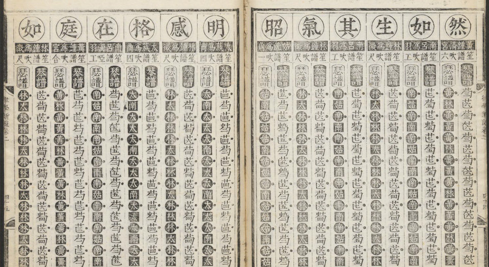
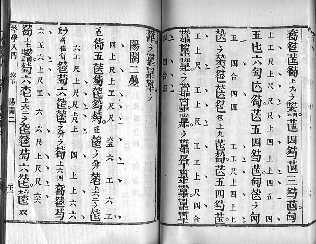
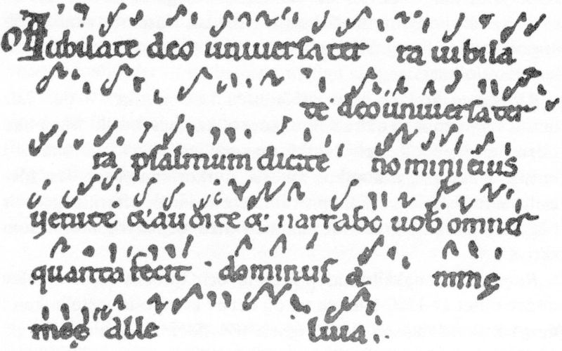
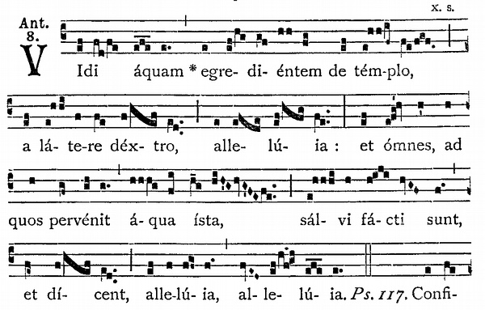
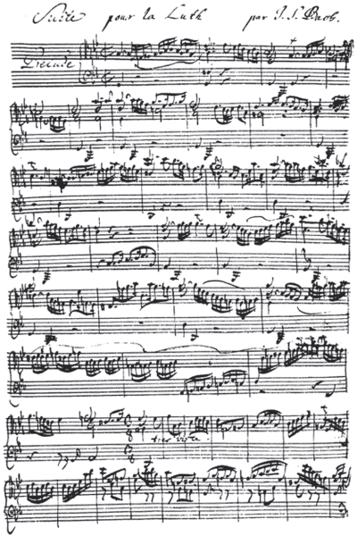
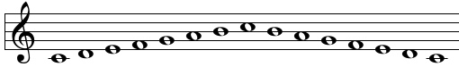
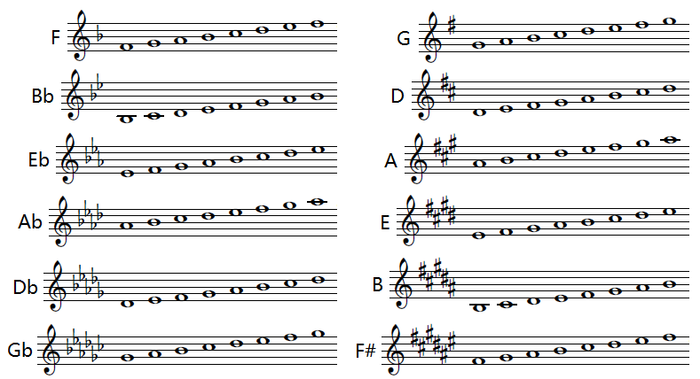
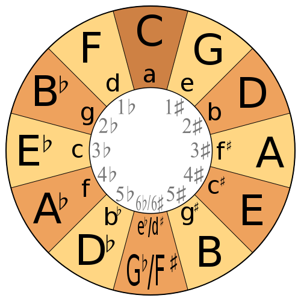
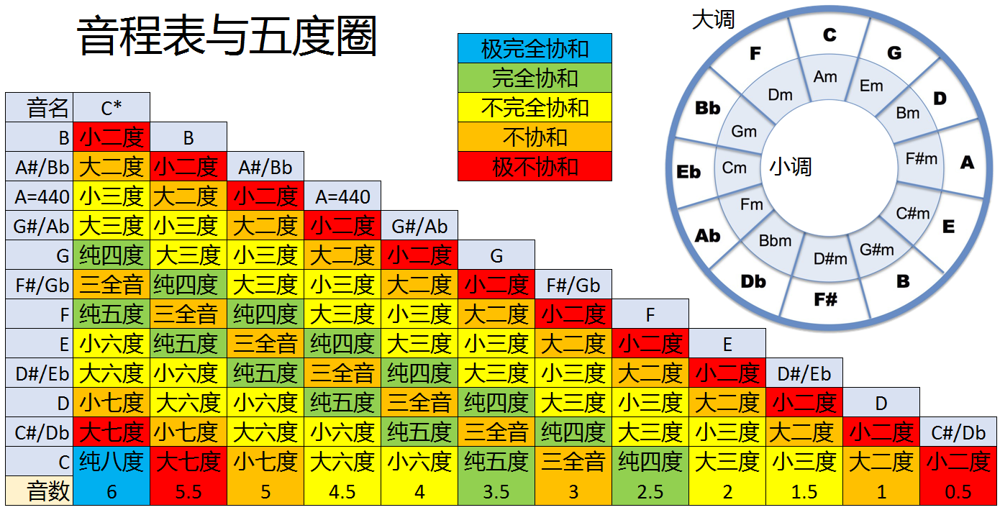

# 调性

[TOC]

这一讲是乐理中有关音调知识的终曲，不过我们还是从历史讲起。

 

## 一、乐理发展史 · 之四

前面的历史课我们了解到“确定**相对**音高”的律制系统是如何在人类的历史长河中慢慢演化，直到形成今天广泛应用的十二平均律系统。这次历史课我们主要回顾用来“确定**绝对**音高”的记谱系统的发展历程。

在人类音乐史上曾经出现过很多种不同的记谱法，大致可分为三大类：文字谱、符号谱和线谱。有不少学者认为文字谱和符号谱应该归为一类，但在下愚见认为，这二者处于不同的发展阶段，且由于文字系统的复杂性（表音文字和表意文字等），文字谱的意义与符号谱是完全不同的。闲言碎语不多讲，我们进入正题。

尽管世界上任何一个地方的人类都在数千年前就开始创造音乐了，但是由于东西方文明的巨大差异，导致发展出了完全不同的记谱系统。早在公元前25世纪，古埃及人就已经制造出了至少几十种各不相同的乐器。尽管现在已经无法考证古埃及人是如何记录音符的，但几乎可以肯定的是：他们已经发展出了比较完善的音乐理论，并且使得每一种乐器都能够合理的校准来配合大型乐队的演奏。

在东方，最古老的乐谱出自于华夏文明，春秋时期的《[礼记·投壶](http://www.guoxue.com/book/liji/0040.htm)》记载了至今发现的最古老乐谱：鼓谱，它是用符号方框和圆圈记录的。到汉代司马迁的《史记》“[律书第三](http://xy.eywedu.com/24/shiji/b025.htm)”中写到：“……九九八十一以为宫。三分去一，五十四以为徵（念zhi，三声）。三分益一，七十二以为商。三分去一，四十八以为羽。三分益一，六十四以为角。”。它的意思是取一根用来定音的竹管，长为81单位，定为“宫音”。然后将81乘上2/3，就得到54单位，定为“徵音”。将徵音的竹管长度54乘上4/3，得到72单位，定为“商音”。将商音72乘2/3，得48单位，为“羽音”。羽音48乘4/3，得64单位，为“角音”。而这宫、商、角、徵、羽五个音高，被称为中国的五音。这种音律方法称为“三分损益法”。

后来人们继续应用三分损益法构造出了另外7个音，并给这一共12个音都起了名字。与现代音名的对照分别是：黄钟（C），林钟（G），太簇（D），南吕（A），姑洗（E），应钟（B），蕤宾（Gb/F#），大吕（Db/C#），夷则（Ab/G#），夹钟（Eb/D#），无射（Bb/A#），仲吕（F）。以这些音名第一个字作为简写就是中国古代使用最广泛的记谱法：“乐律谱”，它属于文字谱的一种。

但是乐律谱的记载太麻烦了，因此人们又发明了“工尺谱”。唐朝已经有工尺谱，传到宋朝极为流行。它具有7个唱名：上、尺、工、凡、六、五、乙，大至对应于西方的{Do,  Re, Mi, Fa, So, La,  Si}。相信最初工尺谱是某种乐器的乐谱，是固定音名，但后来在不同乐器和乐种广泛流传以后，工尺谱逐渐变成不固定的唱名。

图2 清·张鹤《琴学入门》（点击放大）

工尺谱是一种符号谱，但它并非一种精确的记谱法，有很大的空间让表演者作即兴发挥。在传统中国音乐里，乐谱只是一个记载的媒体，表演者并不会完全依据乐谱演奏，他可以加花（加上装饰音），在节奏上也有一定的自由。至于如何演奏才是合适的手法，是约定俗成的，以师父传徒弟的口授心传的方式继承。因此不同流派会有不同的演绎风格，这也是导致中国古代乐理水平进步相当缓慢的主要原因。

西方最早的乐谱出现在古希腊，当时是刻在石碑上的符号谱，难记难读，流传很少。到公元9世纪时出现了写在羊皮纸上“纽姆谱”，见图3。

图3 纽姆谱记录的圣歌（公元9世纪）

后来人们觉得用符号表示音符实在太过麻烦，就尝试在音符间加了一条线，用这条线来代表一个标准音高。后来人们又开始增加线的数量，到11世纪，意大利乐理大师桂多通过对纽姆谱的改进，发明了四线谱，并发从一首圣歌的歌词中提取出了六个音的唱名ut、re、mi、fa、so、la。这就是五线谱和七唱名的前身。

图4 11世纪的纽姆谱

图4所示的古代纽姆谱看起来已经相当接近于现代的五线谱了，不是吗？但是在16世纪之前，西方一直没有一种统一的记谱法，符号的、一线的、两线的、三线的、四线的都有。直到公元十六世纪，五线谱诞生之后才逐渐一统江湖，形成全欧洲音乐人的标准记谱法。而五线谱的真正普及则是发生在17世纪，巴洛克时期的事情了。

图5 巴赫的手稿（1726年）

这时的五线谱就已经和现代五线谱基本相同了。有了统一的记谱法，各地的音乐家们开始更为广泛的沟通和交流，而这时人们慢慢地意识到制定标准音高的重要性。要知道一个17世纪的英国教堂管风琴，使用的音高可能就比同城市中平民使用的键盘乐器低了五个半音。这样的情况对于音乐交流来说简直就是灾难。在1720年的英国音笛演奏中央A的频率为380Hz，而巴赫在汉堡市、莱比锡及魏玛等地使用的管风琴则以480Hz表示同一个音符，这两者约差四个半音。换句话说，1720年的英国音笛演奏的A音在巴赫那边会被认为是F音。

自18世纪早期，音叉（于1711年发明）的使用确实为音高带来了一个可靠的标准，然而差异仍然无法避免。比方说，亨德尔在1740年使用对应为A音的音叉，其频率为422.5赫兹，但在1780年时他使用同样对应A的音叉则有不同的频率：409赫兹，后者低了将近一个半音。不过，到了十八世纪末，中央C上的A所使用的频率渐渐地演进成在400赫兹到450赫兹之间。
上面提到的频率乃是经过现代仪器测量所得，当时的音乐家并没有方法得到如此准确的数值。虽然马兰·梅森在16世纪早期便对声音的频率有了初步的了解，直到十九世纪，在德国物理学家约翰.施布雷在1830年所做的努力之前，人们都没有足够精确的科学方法测量频率。至于用赫兹取代每秒循环次数，则是直到20世纪才做出的改变。

法国政府曾在1859年2月16日通过了一个法案定义中央C上的A为435赫兹。这是把音高尺度标准化的第一个尝试。这个标准之后在法国之外也非常流行，随着时间发展它渐渐从法国音高、大陆音高，最后甚至被称为国际音高。这个标准音域使得中央C的频率调整为约258.65赫兹。而另有一个称为“哲学的”或“科学的”的音高标准，把中央C定义为256赫兹，为此必须把A音调为约430.54赫兹。由于此法提供了一些数学上的便利，所有的C音都是二的次方（C1=32、C2＝64、C3＝128、C4＝256），因此也得到了一些的支持者（包括我在内，呵呵）。不过比起A = 435赫兹，此法并没有得到官方的认可，也因此没有被大量采纳、使用。此种频率规格即称为“物理学音高”。

1926年，美国乐器厂商首先制定了以440Hz作为A音的标准，并以此标准生产乐器。要知道那时的美国音乐实力已经强大到足以与欧洲抗衡，而美国的乐器则更是行销全球。因此到1936年美国标准委员会正式推荐将中央C上面的A音的频率定为440Hz。1955年，国际标准委员会ISO正式接受这一推荐，A-440就成为了ISO的第16号标准。从那时起，全世界的音乐就都在一个调上了。

关于音调的历史大概就是这些了。接下来我们就具体研究一下，这些调到底是什么调。

 

## 二、调性

有了十二平均律，转调不再成为问题，因此人们就能够以不同的音为主音按大调式或小调式构造出不同的音阶，这些设定了主音的音阶序列就称为**调性**。先来研究大调式的所有调性。

我们已经学过大调的音程关系为“全全半全全全半”，那么从12音阶中的任意一个音作为主音都可以得到一个调性。再次列出12音阶的音名：

| 0    | 1     | 2    | 3     | 4    | 5    | 6     | 7    | 8     | 9    | 10    | 11   |
| ---- | ----- | ---- | ----- | ---- | ---- | ----- | ---- | ----- | ---- | ----- | ---- |
| C    | C#/Db | D    | D#/Eb | E    | F    | F#/Gb | G    | G#/Ab | A    | A#/Bb | B    |

调性的名称就是主音的音名，12音阶中有7个音名是不带升降号的，因此以这些音为主音的调性的名称是统一的。然而还有5个音都具有两个音名，例如第2音可以用C#表示也可以用Db表示。这样一来调性的命名就变得混乱了。为了统一命名方式，人们规定这12个调性的名称分别为：{C,  G, D, A, E, B, F#, Db, Ab, Eb, Bb,  F}，并规定以C、G、D、A、E、B、F#为主音的调性用升号#标记五线谱的升降，其它调性用降号b标记五线谱的升降。

首先我们很容易就可以做出C大调，因为以C为主音的7音阶<C D E F G A B>都不带升降号，因此C大调谱是没有升降号的，见图6所示。

图6 C大调音阶

根据之前所学知识，我们很容易构造出其它大调，构造所有小调的原理也相同。这样我们就一共可以获得12个大调和12个小调。其中12个大调见图7所示。

图7 除C大调外11个大调的音阶（Gb和F#实为同一个调）

由于Gb调中每个音符都降了半音，F#调中每个音符都升半音的本质是相同的，因此和它们是同一个调。此外，有些谱子会用7个降号来表示Cb大调，实际上C降半音就是B，那么Cb大调就是B大调。还有7用个升号表示C#大调，C升半音就是Db，因此C#大调就是Db大调。这样一来，Bb大调所有音升半音就得到了B大调，Eb大调所有音升半音就得到了E大调，F#大调所有音降半音就得到了F大调，其它的升降大调也是相同。大调确定了，关系小调也就可以确定了。为了便于记忆这24个调，有人发明了五度圈图示法，见图7所示。

图7 调性五度圈

在五度圈的最外圈是大调的12个调性，内圈是各大调对应的关系小调。顺时针相邻两个大调的主音相差五度，小调亦然。圈里面的数字是该调性的五线谱中升降号的数量。最顶上的C大调没有任何升降号，顺时针方向升号依次增多，逆时针方向降号依次增多。最下面的Gb调和F#调实际上是一个调，只是记谱不同而已，可使用6个降号表示，也可使用6个升号表示。

对于五度圈右边的每个升号大调，从F开始以逆时针方向数，到它前面的2格为止，都是它的音阶中要升半音的音符，例如E大调的音阶中F、C、G、D都升半音，对于B大调的音阶中，F、C、G、D、A都要升半音。对于左侧的降号大调，则是从B开始以逆时针方向数，到它正对面调都是它的音阶中要降半音的音符，例如Ab大调的音阶中B、E、A、D都要降半音，Db大调的音阶中B、E、A、D、G都要降半音。

五度圈还有一些规律要知道，从任何一个音开始逆时针数，第一个音与它的音数是2.5；顺时针数第一个是3.5。这个规律可以帮你用五度圈来推算音程。比如要求G到F#的音程，从五度圈可知F#是G顺时针方向第5个，(5*3.5)%6=5.5，即大七度。再看从F到Ab，是逆时针第3个，(3*2.5)%6=1.5，即小三度。取模神马的对码农来说简直弱爆了，呵呵。

用上面的规律和方法，我们可以从五度圈中可以推导出所有的音程关系、音阶和调性，因此说大半的乐理都在五度圈里了。但它的结构复杂，被众多文艺生视为洪水猛兽，对于理工科人如何呢？告诉您一个小技巧那就是**肥猫下楼吃面包**的故事。上午11点，猫饿了，所以**F**at **C**at **G**o **D**own **A**nd **E**at **B**read； 到下午6点猫又饿了，再次**G**o **D**own **A**nd **E**at **B**read。也就是说从五度圈的11点开始，顺时针方向依次是FCGDAEB，从6点钟开始又是GDAEB，由于是晚上这些音都要降半音，即在后在面都加个b。这样就好记多了吧？为了方便朋友们复习和查阅，我制做了一幅音程表和五度圈的一体图，见图8。

 图8 音程表与五度圈（点击放大）

音程与音数的对应记忆起来稍难一些，但是也有技巧。音程口决是：“**小大小大纯三纯，小大小大纯**”。前7个从小二度开始，后5个从小六度开始。掰指头数一下这个音程排在总第几位，除以2就是它的音数。比如小七度排在第10位，音数就是5。

到这里所有有关音调的基础乐理就介绍完了，有不周之处，请多担待。不过如果您把之前的课程都认真的学通了，那么这些乐理知识足以让您在学习任何乐器时都不会对音和调的问题产生困扰。此外，如果您还想尝试音乐创作或评论，这些内容也是重要的基本功。

 

## 三、总结

本还想加入一些赏析的内容，但是由于我要忙其它的事情，因此没有时间来写了，等后面再补充吧。这系列文章会停止更新一段时间，希望不会太久。下一次再见面，我们会继续讨论五线谱和节奏相关的内容。

感谢大家的关注。最后请欣赏贝多芬《D大调小提琴协奏曲》第一乐章，帕尔曼独奏、巴伦勃依姆指挥。

注意帕尔曼坐定以后轻轻的拉响了A弦（A弦的空弦音为A），示意双簧管给一个A的音准。双簧管是整个乐队的音准，必须事先调好，然后在乐队开始演奏前奏出A音供大家调音。帕尔曼首先听了听A，确定没问题。然后又同时拉下A弦和右边的E弦，听听有没有产生拍音，如果产生拍音就说明E也是准的。随后又分别同时拉响A和左边的D弦，确定D没有问题后以D为音准调整了G弦的弦轴。